<div align="center">

# 🎯 FitConnect

**AI 기반 인재-기업 매칭 플랫폼**

[](https://fastapi.tiangolo.com/)
[](https://www.python.org/)
[](https://www.sqlalchemy.org/)
[](https://www.mysql.com/)
[](https://python-poetry.org/)

*벡터 기반 매칭 엔진으로 인재와 기업의 완벽한 만남을 실현합니다*

[API 문서](#-api-문서) •
[시작하기](#-시작하기) •
[기능](#-주요-기능) •
[아키텍처](#-아키텍처)

</div>

---

## 📋 목차

- [개요](#-개요)
- [주요 기능](#-주요-기능)
- [기술 스택](#-기술-스택)
- [시작하기](#-시작하기)
- [API 문서](#-api-문서)
- [프로젝트 구조](#-프로젝트-구조)
- [데이터베이스](#-데이터베이스)
- [매칭 알고리즘](#-매칭-알고리즘)
- [개발 가이드](#-개발-가이드)
- [배포](#-배포)

---

## 🌟 개요

**FitConnect**는 AI 벡터 임베딩 기술을 활용하여 인재와 기업을 지능적으로 매칭하는 플랫폼입니다. 
단순한 키워드 매칭을 넘어, 6개 차원의 벡터 공간에서 인재의 역량과 기업의 요구사항을 분석하여 
최적의 매칭 결과를 제공합니다.

### 🎨 핵심 가치

- **🔍 정밀한 매칭**: 역할, 스킬, 성장성, 경력, 비전, 문화 6개 차원 분석
- **⚡ 실시간 추천**: 벡터 유사도 기반 즉각적인 매칭 결과 제공
- **📊 투명한 점수**: 차원별 매칭 점수로 근거 있는 추천
- **🎯 맞춤형 필터**: 희망 연봉, 위치, 기업 규모 등 다양한 조건 설정

---

## ✨ 주요 기능

### 👥 인재 관리
- ✅ 프로필 관리 (학력, 경력, 활동, 자격증)
- ✅ 관심 내용 설정 (희망 직무, 연봉, 업종, 기업 규모, 근무 지역)
- ✅ 인재 카드 생성 및 공개
- ✅ 벡터 임베딩 자동 생성

### 🏢 기업 관리
- ✅ 기업 정보 관리
- ✅ 채용 공고 등록 및 관리
- ✅ 채용 공고 카드 생성
- ✅ 벡터 임베딩 자동 생성

### 🎯 매칭 시스템
- ✅ 6차원 벡터 유사도 계산
- ✅ 실시간 매칭 결과 생성
- ✅ 차원별 매칭 점수 제공
- ✅ 최소 점수 필터링
- ✅ 매칭 결과 정렬 및 페이징

### 🔐 인증 & 보안
- ✅ JWT 기반 인증
- ✅ bcrypt 비밀번호 해싱
- ✅ Role 기반 접근 제어 (talent/company)
- ✅ CORS 설정

---

## 🛠 기술 스택

### Backend Framework
- **FastAPI** - 고성능 비동기 웹 프레임워크
- **Pydantic** - 데이터 검증 및 직렬화
- **SQLAlchemy 2.0** - ORM 및 데이터베이스 관리
- **Alembic** - 데이터베이스 마이그레이션

### Database
- **MySQL 8.0+** - 관계형 데이터베이스
- **PyMySQL** - MySQL 드라이버

### Authentication & Security
- **python-jose** - JWT 토큰 생성/검증
- **passlib** - 비밀번호 해싱
- **bcrypt** - 암호화 알고리즘

### Development Tools
- **Poetry** - 의존성 관리
- **pytest** - 테스트 프레임워크
- **Ruff & Black** - 코드 포맷팅
- **isort** - import 정렬

### Vector Processing
- **NumPy** - 벡터 연산
- **Cosine Similarity** - 벡터 유사도 계산

---

## 🚀 시작하기

### 📋 사전 요구사항

- Python 3.10 이상
- MySQL 8.0 이상
- Poetry 1.5 이상

### 1️⃣ 저장소 클론

```bash
git clone https://github.com/jaylions/fitconnect-backend.git
cd fitconnect-backend
```

### 2️⃣ 의존성 설치

```bash
poetry install
```

### 3️⃣ 환경 변수 설정

```bash
cp .env.example .env
```

`.env` 파일을 열어 다음 값들을 설정하세요:

```bash
APP_ENV=local
APP_HOST=0.0.0.0
APP_PORT=8000

# JWT 설정
JWT_SECRET=your-super-secret-key-here
JWT_ALG=HS256
JWT_EXPIRE_MINUTES=120

# 데이터베이스 설정
DB_HOST=127.0.0.1
DB_PORT=3306
DB_USER=fitc
DB_PASSWORD=your-db-password
DB_NAME=fitconnect
```

### 4️⃣ 데이터베이스 생성

```bash
mysql -u root -p
```

```sql
CREATE DATABASE fitconnect CHARACTER SET utf8mb4 COLLATE utf8mb4_unicode_ci;
CREATE USER 'fitc'@'localhost' IDENTIFIED BY 'your-db-password';
GRANT ALL PRIVILEGES ON fitconnect.* TO 'fitc'@'localhost';
FLUSH PRIVILEGES;
```

### 5️⃣ 데이터베이스 마이그레이션

```bash
poetry run alembic upgrade head
```

### 6️⃣ Mock 데이터 생성 (선택사항)

테스트를 위한 Mock 데이터를 생성합니다:

```bash
poetry run python scripts/seed_mock_data.py --clean
```

생성되는 데이터:
- 인재 유저 5명 (Frontend, Backend, Marketer, PM, Sales)
- 기업 유저 5개 + 채용공고 5개
- 매칭 벡터 10개
- 매칭 결과 27개

> 📖 자세한 내용은 [Mock 데이터 가이드](scripts/README_MOCK_DATA.md)를 참조하세요.

### 7️⃣ 서버 실행

#### 개발 모드
```bash
poetry run uvicorn app.main:app --reload --host 0.0.0.0 --port 8000
```

#### 프로덕션 모드 (백그라운드)
```bash
nohup poetry run uvicorn app.main:app --host 0.0.0.0 --port 8000 > server.log 2>&1 & echo $! > app.pid
```

서버 종료:
```bash
kill $(cat app.pid)
```

### 8️⃣ API 문서 확인

브라우저에서 다음 주소로 접속:

- **Swagger UI**: http://localhost:8000/docs
- **ReDoc**: http://localhost:8000/redoc
- **Health Check**: http://localhost:8000/health

---

## 📚 API 문서

### 🔐 인증 (Authentication)

#### 회원가입
```http
POST /auth/register
Content-Type: application/json

{
  "email": "user@example.com",
  "password": "password123",
  "role": "talent"  // or "company"
}
```

#### 로그인
```http
POST /auth/login
Content-Type: application/json

{
  "email": "user@example.com",
  "password": "password123"
}
```

**응답:**
```json
{
  "access_token": "eyJhbGciOiJIUzI1NiIsInR5cCI6IkpXVCJ9...",
  "token_type": "bearer",
  "user": {
    "id": 1,
    "email": "user@example.com",
    "role": "talent"
  }
}
```

### 👤 인재 API

#### 프로필 조회
```http
GET /api/me/talent/basic
Authorization: Bearer {token}
```

#### 전체 프로필 조회
```http
GET /api/me/talent/full
Authorization: Bearer {token}
```

#### 프로필 저장
```http
POST /api/me/talent/full
Authorization: Bearer {token}
Content-Type: application/json

{
  "basic": {
    "name": "김민수",
    "email": "minsu@example.com",
    "tagline": "React 전문 Frontend Developer",
    "desired_role": "Frontend Developer",
    "desired_salary": "4000만원 이상",
    "desired_industry": "IT·인터넷",
    "desired_company_size": "51~200명",
    "residence_location": "서울 강남구",
    "desired_work_location": "서울 전체"
  },
  "educations": [...],
  "experiences": [...],
  "activities": [...],
  "certifications": [...],
  "documents": [...]
}
```

### 🏢 기업 API

#### 기업 정보 조회
```http
GET /api/me/company
Authorization: Bearer {token}
```

#### 채용 공고 등록
```http
POST /api/me/company/job-postings
Authorization: Bearer {token}
Content-Type: application/json

{
  "title": "React Frontend 개발자 모집",
  "employment_type": "정규직",
  "location": "서울 강남구",
  "salary_min": 40000000,
  "salary_max": 60000000,
  ...
}
```

### 🎯 매칭 API

#### 인재 → 채용공고 매칭 조회
```http
GET /api/matching-results/talents/{user_id}/job-postings?min_score=70&limit=10
Authorization: Bearer {token}
```

**응답:**
```json
{
  "ok": true,
  "data": {
    "talent_user_id": 1,
    "matches": [
      {
        "job_posting_id": 1,
        "company_user_id": 10,
        "total_score": 98.5,
        "role_score": 99.2,
        "skill_score": 99.5,
        "growth_score": 97.8,
        "career_score": 98.1,
        "vision_score": 99.0,
        "culture_score": 97.5,
        "calculated_at": "2025-10-25T12:00:00"
      }
    ],
    "total_count": 5
  }
}
```

#### 채용공고 → 인재 매칭 조회
```http
GET /api/matching-results/job-postings/{job_posting_id}/talents?min_score=70&limit=10
Authorization: Bearer {token}
```

### 📊 벡터 API

#### 매칭 벡터 조회
```http
GET /api/public/matching-vectors/{user_id}
```

**응답:**
```json
{
  "user_id": 1,
  "role": "talent",
  "vector_roles": {"dim": 5, "vector": [0.9, 0.8, 0.7, 0.6, 0.5]},
  "vector_skills": {"dim": 5, "vector": [0.95, 0.9, 0.85, 0.8, 0.75]},
  "vector_growth": {"dim": 5, "vector": [0.8, 0.7, 0.75, 0.85, 0.7]},
  "vector_career": {"dim": 5, "vector": [0.7, 0.8, 0.6, 0.75, 0.85]},
  "vector_vision": {"dim": 5, "vector": [0.85, 0.8, 0.75, 0.7, 0.8]},
  "vector_culture": {"dim": 5, "vector": [0.8, 0.85, 0.7, 0.75, 0.9]}
}
```

---

## 📁 프로젝트 구조

```
fitconnect-backend/
├── 📂 alembic/                 # 데이터베이스 마이그레이션
│   └── versions/              # 마이그레이션 버전 파일
├── 📂 app/
│   ├── 📂 api/                # API 라우터 및 의존성
│   │   ├── auth.py           # 인증 엔드포인트
│   │   ├── deps.py           # 공통 의존성 (DB, 인증)
│   │   └── routes/           # 도메인별 라우터
│   │       ├── talent.py     # 인재 API
│   │       ├── company.py    # 기업 API
│   │       ├── matching_result.py   # 매칭 결과 API
│   │       ├── matching_vector.py   # 매칭 벡터 API
│   │       └── ...
│   ├── 📂 core/              # 핵심 설정
│   │   ├── security.py       # 보안 (JWT, 해싱)
│   │   └── settings.py       # 환경 설정
│   ├── 📂 db/                # 데이터베이스 설정
│   │   ├── base.py           # Base 모델
│   │   ├── session.py        # DB 세션 관리
│   │   └── types.py          # 커스텀 타입
│   ├── 📂 models/            # SQLAlchemy 모델
│   │   ├── user.py           # 사용자 모델
│   │   ├── profile.py        # 인재 프로필 모델
│   │   ├── company.py        # 기업 모델
│   │   ├── job_posting.py    # 채용 공고 모델
│   │   ├── matching_vector.py    # 매칭 벡터 모델
│   │   ├── matching_result.py    # 매칭 결과 모델
│   │   ├── education.py      # 학력 모델
│   │   ├── experience.py     # 경력 모델
│   │   └── ...
│   ├── 📂 repositories/      # 데이터 액세스 레이어
│   │   └── matching_result.py
│   ├── 📂 schemas/           # Pydantic 스키마
│   │   ├── auth.py           # 인증 스키마
│   │   ├── talent_read.py    # 인재 조회 스키마
│   │   ├── full_profile.py   # 전체 프로필 스키마
│   │   ├── job_posting.py    # 채용 공고 스키마
│   │   └── ...
│   ├── 📂 services/          # 비즈니스 로직
│   │   ├── talent_read.py    # 인재 조회 서비스
│   │   ├── talent_write.py   # 인재 수정 서비스
│   │   ├── full_profile.py   # 프로필 저장 서비스
│   │   └── vector_matching_service.py  # 매칭 서비스
│   └── main.py              # FastAPI 앱 진입점
├── 📂 scripts/              # 유틸리티 스크립트
│   ├── seed_mock_data.py    # Mock 데이터 생성
│   └── README_MOCK_DATA.md  # Mock 데이터 가이드
├── 📂 tests/                # 테스트 코드
├── .env.example             # 환경 변수 템플릿
├── alembic.ini              # Alembic 설정
├── docker-compose.yml       # Docker 설정
├── pyproject.toml           # Poetry 의존성 설정
└── README.md               # 프로젝트 문서
```

---

## 🗄 데이터베이스

### ERD 개요

```
Users (사용자)
  ├── TalentProfiles (인재 프로필)
  │   ├── Educations (학력)
  │   ├── Experiences (경력)
  │   ├── Activities (활동)
  │   ├── Certifications (자격증)
  │   └── Documents (문서)
  │
  ├── Companies (기업)
  │   └── JobPostings (채용공고)
  │
  └── MatchingVectors (매칭 벡터)
      └── MatchingResults (매칭 결과)
```

### 주요 테이블

#### `users`
- 사용자 기본 정보 (이메일, 비밀번호, 역할)
- Role: `talent` (인재) / `company` (기업)

#### `talent_profiles`
- 인재 상세 정보
- 관심 내용: 희망 직무, 연봉, 업종, 기업 규모, 주거/근무 지역

#### `companies`
- 기업 정보
- 업종, 규모, 주소, 홈페이지 등

#### `job_postings`
- 채용 공고
- 고용 형태, 지역, 연봉, 포지션, 근무 조건 등

#### `matching_vectors`
- 6차원 벡터 저장 (JSON)
- `vector_roles`, `vector_skills`, `vector_growth`, `vector_career`, `vector_vision`, `vector_culture`

#### `matching_results`
- 매칭 결과 및 점수
- 6개 차원별 점수 + 총점

### 마이그레이션 관리

#### 새 마이그레이션 생성
```bash
poetry run alembic revision --autogenerate -m "description"
```

#### 마이그레이션 적용
```bash
poetry run alembic upgrade head
```

#### 마이그레이션 롤백
```bash
poetry run alembic downgrade -1
```

#### 현재 버전 확인
```bash
poetry run alembic current
```

---

## 🧮 매칭 알고리즘

### 6차원 벡터 매칭

FitConnect는 다음 6개 차원에서 인재와 기업을 분석합니다:

| 차원 | 설명 | 가중치 |
|-----|------|--------|
| 🎯 **Roles** | 직무 및 역할 적합성 | 1/6 |
| 💡 **Skills** | 기술 스택 및 역량 | 1/6 |
| 📈 **Growth** | 성장 가능성 및 학습 의지 | 1/6 |
| 🏆 **Career** | 경력 수준 및 경험 | 1/6 |
| 🔭 **Vision** | 비전 및 목표 일치도 | 1/6 |
| 🌈 **Culture** | 문화 및 가치관 적합도 | 1/6 |

### 유사도 계산

1. **코사인 유사도 계산**
   ```
   similarity = (A · B) / (||A|| × ||B||)
   ```
   - 결과 범위: -1 ~ 1

2. **점수 정규화**
   ```
   score = ((similarity + 1) / 2) × 100
   ```
   - 결과 범위: 0 ~ 100점

3. **총점 계산**
   ```
   total_score = average(role_score, skill_score, growth_score, 
                        career_score, vision_score, culture_score)
   ```

### 매칭 프로세스

```mermaid
graph LR
    A[프로필 입력] --> B[벡터 생성]
    B --> C[벡터 저장]
    C --> D[유사도 계산]
    D --> E[점수 산출]
    E --> F[결과 저장]
    F --> G[추천 제공]
```



---

## 👨‍💻 개발 가이드

### 코드 스타일

프로젝트는 다음 도구를 사용합니다:

```bash
# 코드 포맷팅
poetry run black .

# Import 정렬
poetry run isort .

# 린팅
poetry run ruff check .
```

자동 포맷팅:
```bash
poetry run black . && poetry run isort .
```

### 테스트 실행

```bash
# 전체 테스트
poetry run pytest

# 커버리지 포함
poetry run pytest --cov=app

# 특정 파일
poetry run pytest tests/test_vector_matching_service.py
```

### 새로운 API 추가하기

1. **모델 정의** (`app/models/`)
   ```python
   # app/models/new_model.py
   from app.db.base import Base
   
   class NewModel(Base):
       __tablename__ = "new_table"
       # ...
   ```

2. **스키마 정의** (`app/schemas/`)
   ```python
   # app/schemas/new_schema.py
   from pydantic import BaseModel
   
   class NewModelCreate(BaseModel):
       # ...
   ```

3. **라우터 추가** (`app/api/routes/`)
   ```python
   # app/api/routes/new_route.py
   from fastapi import APIRouter
   
   router = APIRouter(prefix="/api/new", tags=["new"])
   
   @router.get("/")
   def get_items():
       # ...
   ```

4. **main.py에 등록**
   ```python
   from app.api.routes.new_route import router as new_router
   
   app.include_router(new_router)
   ```

5. **마이그레이션 생성 및 적용**
   ```bash
   poetry run alembic revision --autogenerate -m "add new model"
   poetry run alembic upgrade head
   ```

---

## 🚢 배포

### Docker 배포

```bash
# 이미지 빌드
docker-compose build

# 컨테이너 실행
docker-compose up -d

# 로그 확인
docker-compose logs -f

# 컨테이너 중지
docker-compose down
```

### 환경별 설정

#### Development
```bash
APP_ENV=development
```

#### Production
```bash
APP_ENV=production
# JWT_SECRET을 강력한 키로 변경
# CORS origins 제한
```

### 헬스 체크

```bash
curl http://localhost:8000/health
```

**응답:**
```json
{
  "ok": true,
  "service": "fitconnect",
  "status": "healthy"
}
```

---

## 📝 추가 문서

- [벡터 생성 가이드](VECTOR_CREATION_GUIDE.md)
- [Mock 데이터 가이드](scripts/README_MOCK_DATA.md)
- [ENUM 변경 이력](CHANGELOG_JOB_POSTING_ENUMS.md)
- [Swagger 테스트 데이터](swagger_test_data.md)

---

## 🤝 기여하기

1. Fork the Project
2. Create your Feature Branch (`git checkout -b feature/AmazingFeature`)
3. Commit your Changes (`git commit -m 'Add some AmazingFeature'`)
4. Push to the Branch (`git push origin feature/AmazingFeature`)
5. Open a Pull Request

---

## 📄 라이선스

이 프로젝트는 MIT 라이선스 하에 배포됩니다.

---

## 👥 개발팀

**Backend Developer**: [@jaylions](https://github.com/jaylions)

---

## 🙏 감사의 말

이 프로젝트는 다음 오픈소스 프로젝트들의 도움을 받았습니다:

- [FastAPI](https://fastapi.tiangolo.com/)
- [SQLAlchemy](https://www.sqlalchemy.org/)
- [Pydantic](https://pydantic-docs.helpmanual.io/)
- [Alembic](https://alembic.sqlalchemy.org/)

---

<div align="center">

**⭐ 이 프로젝트가 도움이 되셨다면 Star를 눌러주세요! ⭐**

Made with ❤️ by FitConnect Team

</div>
